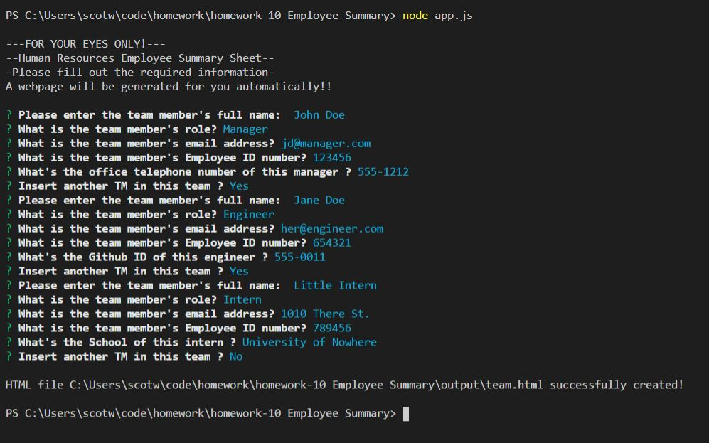
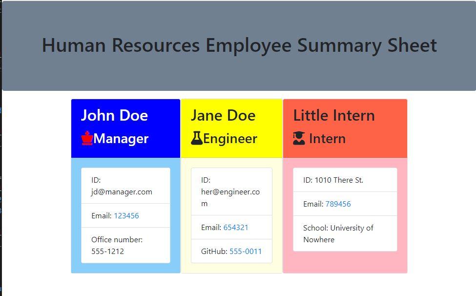

# 10 OOP Homework: Template Engine - Employee Summary

## Description

This is a Node CLI that will create an .html page based upon terminal input from the user in the form of an employee summary. I imagined that it was for a Human Resources position to enter in essential employee information. The code allows for Manager, Engineer, and Intern classifications and changes input lines based upon the classification. Each class changes the color of the individual and the html is simple.

### Screenshot

#### Link to Deployed Application
[Employee Summary Github Link](https://github.com/scotwoodland/Employee_Summary_Template) is hosted on Github pages.
